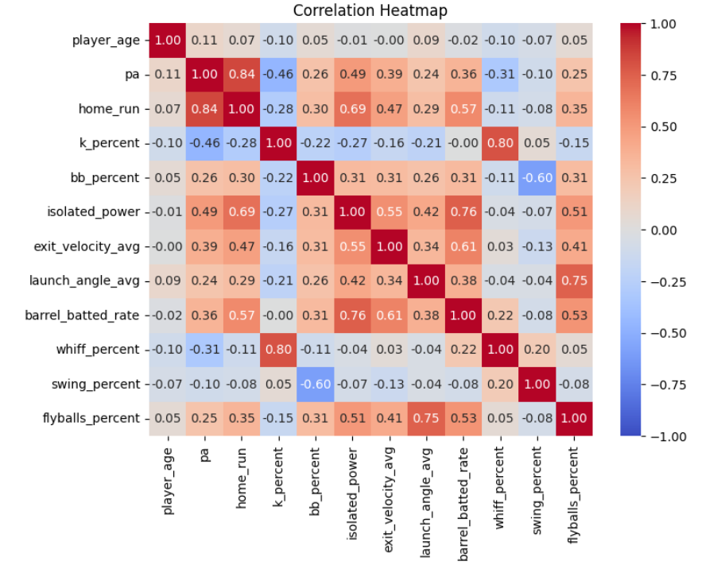

# **2025 MLB Season Home Run Predictions Leaderboard**

## **Project Overview**
This project predicts the number of home runs that MLB players will hit in the upcoming season. Using historical player data, the model estimates future performance and presents a league-wide home run predictions leaderboard.

## **Methodology**

### **1. Data Collection**
The dataset includes statistics for all players with a minimum of 10 plate appearances from the 2017-2024 MLB seasons, with the exception of 2020, such as:
- Player age, plate appearances, home runs, ISO, exit velocity, launch angle, Barrel%, etc.

While I considered limiting the dataset to only players that reached a certain threshold of plate appearances, I decided against that because it would hinder our model's predictive power. The data was preprocessed to ensure consistency and relevancy, focusing on features that correlate strongly with home run hitting ability.
In addition, the dataset includes statistics for the 2025 MLB season, which consists of their projected plate appearances according to Steamer, their age in the 2025 season, and their statistics from 2024 for the rest of the columns. This data will be manipulated later in the process to be used for prediction. 

### **2. Data Exploration**
The distribution of player home run totals in a season is shown below:

Given that the dataset includes all players with at least 10 plate appearances in each season, it should be expected that the majority of player home run totals are 5 and below. Since there is limited data available for totals beyond 40, we need to ensure that
our model can account for these outliers because they happen to be the players that most fans are interested in.

Although the data was preprocessed to include features relevant to home runs based on intuition, we will create a correlation heatmap to confirm:

Plate appearances and ISO are the features that show the strongest correlation to home runs, so they should likely be incorporated into our model.

### **3. Model Selection/Data Partitioning**

The goal of this project is to predict future numerical totals, so I believe a gradient boosting model, specifically XGBoost's XGBRegressor, is the optimal choice because it can:
- Model complex, non-linear relationships that are common in baseball statistics.
- Capture feature interactions and high-dimensional data.
- Prevent overfitting through built-in regularization.

Now that we have chosen a model, the next step is to partition our dataset to ensure that the model can generalize to unseen data:
- Training data: 2017-2023 MLB seasons, except 2020.
- Validation data: 2024 MLB season.
- Testing data: 2025 MLB season.

Since the 2024 MLB season will be incorporated into our testing data, our model will provide a predicted home run total in 2025 for every player with a minimum of 10 plate appearances in 2024. As a result, players that missed the entire 2024 season due to injury or any prospects that are expected to be called up will not be included in the leaderboard.

### **4. Feature Selection/Engineering**

To begin the process of feature selection, we will create a baseline model with the entire dataset as features to be used for comparison to later iterations. The RMSE of our baseline model is 1.6697, which is solid but can be improved upon.

In terms of feature importance, plate appearances and ISO are undoubtedly the most relevant, which aligns with our intuition from the correlation heatmap.

Next, I created several interaction terms and lagged features that I thought might be able to increase the performance of our model. The most relevant features were:
- HR_3YrAvg: Rolling average home runs of the past three seasons.
- ExitVelo_FlyBall: Interaction between exit velocity and Flyball%.
- BB_K: Interaction between BB% and K%.
- launch_exit_combo: Interaction between launch angle and exit velocity.

With these new features, I ran an exhaustive search to derive the optimal feature combination that resulted in the lowest RMSE. After incorporating this feature combination into the model, I was content with concluding feature selection for the model because the RMSE decreased to 1.5998. The residual plot for the post-feature engineering model is shown below:

Based on the graph, we can derive that our model performs very well on low home run totals but the variance of errors increases with the predicted values. In addition, the model appears to overpredict when it is off by the largest totals, which can possibly be attributed to injuries.

### **5. Hyperparameter Tuning/Validation**

The final step in our modeling process is tune our hyperparameters to best fit our model. In order to decide which hyperparameters to test, we can look at the learning curve of the current model:

The training error of the model is very low and remains consistent across all training set sizes, suggesting that the model is fitting the data well. The validation error gradually declines as the training set size increases, so adding more data could help the model
generalize better. However, the biggest takeaway from the learning curve is the gap between the training and validation errors, signaling potential overfitting.

To address the overfitting, I tested the following adjustments by performing a grid search on the validation set while optimizing RMSE:
- Increasing regularization.
- Reducing model complexity.
- Introducing randomness.
- Creating a more gradual learning process.

After obtaining the best parameters and RMSE of 1.5343 from the grid search, we need to validate that the model is no longer overfitting. 

The gap between the training and validation errors of the new model is much smaller and appears to converge as the training set size increases, leading me to
believe that we have solved the previous issue of overfitting.

Looking at the new residuals graph, we can see that the model has improved in its ability to predict home run totals in the 10-30 range. While some outliers still remain, I believe that the predictive power of the model is sufficient to accomplish our goal of predicting home run totals for next season.

### **6. Model Deployment/Results**

Now that we have the completed model, we just need to deploy it on our testing set to generate our predictions for the 2025 MLB season. 
Since our testing set uses 2024 data for all of our features except plate appearances, we need to regress these statistics to the mean to account for the expected variance in player performance between seasons. I chose to use a weighted approach for the regression, where
outliers are pulled closer to the mean. I believe that this approach should prevent the model from overpredicting on players that have inflated 2024 data due to small sample sizes and limit the punishment for historically prolific players who had a bad 2024 season.

The complete league-wide home run predictions leaderboard is captured in a csv file stored within this depository, while the top 20 players are shown below:

Unsurprisingly, Aaron Judge and Shohei Ohtani are projected to lead MLB in home runs again next season, but they should be expected to fall short of their historic totals from the 2024 season. Under the assumption that their injury struggles will be left in 2024, Kyle Tucker and Mike Trout are projected to return to the top of the home run leaderboard,
while Mark Vientos should continue building on his breakout year to become one of the best power threats in MLB. We should also expect to see some regression from Cal Raleigh and Shea Langeliers, two of the biggest surprises from last season, as their underlying statistics
suggest that luck may have been on their side in 2024.
